# ML Project Midterm Checkpoint: House Price Prediction in Southern California 

### Group 118  
**Aditya Sriram, Soham Pati, Blake Alford, Erik Larson, Eric Joseph**

---

## 1. Introduction / Background 

The real estate market in Southern California is always changing and one of the most expensive markets in the country. Home prices vary because of high demand and low supply. Predicting those prices becomes difficult, as there are so many factors influencing these values such as location, number of bedrooms and bathrooms, lot size, square footage, and proximity to amenities and major employment centers. 

### Dataset Description 

Our dataset contains over 15000 house prices and data. For each house we keep track of the address and city. As well as the number of rooms, bathrooms and square feet.

LINK: https://www.kaggle.com/datasets/ted8080/house-prices-and-images-socal/code

### Literature Review
Prior research has explored ML approaches for predicting housing prices. Ihre and Engström [2] found Random Forest outperformed k-Nearest Neighbors on the Ames dataset, while Truong et al. [3] showed combining traditional and ensemble methods improves accuracy when features are carefully selected.
These studies focus on numeric and structural features and rarely use unsupervised techniques. Clustering and PCA can reveal latent structures, like neighborhood clusters or price bands, enhancing predictions [2], [3]. Outlier detection can further improve accuracy. Our project integrates these insights into a supervised pipeline to predict Southern California housing prices using the 2021 Kaggle dataset [1], aiming for higher accuracy and interpretable key price drivers.

---

## 2. Problem Definition 

**Problem:** Are we able to utilize historical property data from 2021 to then create machine learning models to predict the price of a home based on property features?

**Motivation:**  Housing affordability is one of the biggest issues in all of Southern California. Creating accurate price prediction models could help buyers figure out fair market values, help realtors with price strategies and also support lawmakers in creating proper legislation using market trends.

---

## 3. Methods  

### Data Preprocessing 

1. **Missing value imputation:** sklearn.impute.SimpleImputer(strategy="median") for numeric, SimpleImputer(strategy="most_frequent") for categorical. This will ensure that data that is missing values or data that is skewed is not lost.
2. **Feature Engineering:** We can add features for half baths, and also for other important metrics like price per square foot, sqaure foot per room, etc. This will also allow us to convert our data so it more sense and can be understood better.
3. **Categorical encoding:** sklearn.preprocessing.OneHotEncoder(handle_unknown='ignore'). For features which are categorical(city, etc.) we will transform it into a numerical representation. This will alow for models like linear regression to treat cities like different entities without a ranking or order.
4. **Pipelining:** sklearn.pipeline.Pipeline to combine transforms + models for reproducibility and grid search. We can chain together the above preprocessing steps into one pipeline for easy accessibility and convenient runs.

### Machine Learning Models 

**Regression (Supervised)**
**Model/Algorithm:** Linear Regression (`sklearn.linear_model.LinearRegression`)  
A simple model that predicts housing prices as a weighted combination of input features, assuming a linear relationship.

---

## 4. Results and Discussion 
### Preprocessing Results
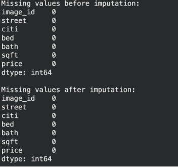

We used **imputation** as our first preprocessing method. Essentially what we did was, for features that were missing for entries, we took the median of the values for that feature and imputed. In the case above as you can see, our dataset was great, and had no missing values.

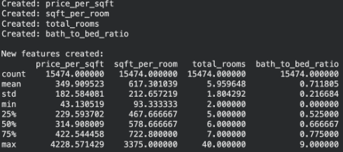

The screenshot above shows what we did for feature engineering. We created four features: price per square foot, square foot per room, total rooms, and bath to bed ratio. To derive price_per_sqft, we took the existing price feature and divided the sqft feature for each entry. For sqft_per_room, we took square foot of each property, divided by each bedroom. One notable thing we did: if a property had 0 bedrooms, we replaced the denominator with 1, avoiding DivideByZero error. Total rooms feature is just the summation of rooms and bathrooms.Bath to bed ratio is self explanatory.

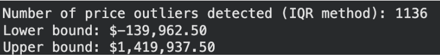

One solution deployed in practice included the preparation of a dataset through  statistical analysis. The IQR method was used to find probable outliers in housing prices, but these were not removed because keeping them maintains full market variability and doesn't bias the data toward normal price ranges. In this case, some calculations of the lower bound for outliers were negative, which is purely a mathematical effect of the IQR formula and not a meaningful real-world value: the price of housing cannot be negative, so it simply means there are no low-value outliers.

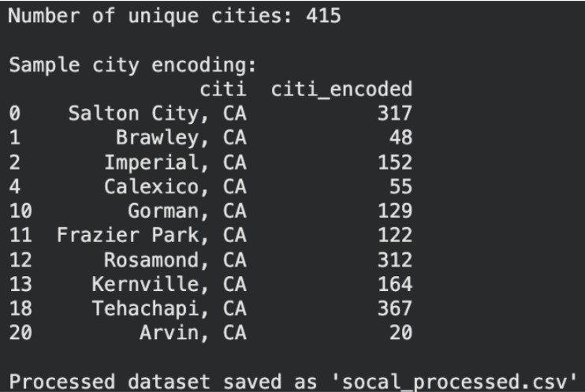

We used encoding to turn the qualitative city name category into numerical values. This is because ML models cannot handle categorical data like city names. Each unique city string got mapped to a unique integer ID. We applied categorical encoding to convert city names into numeric representations, since linear regression models require numerical input features and cannot process categorical text directly.

### Linear Regression Model and Evaluation

This shows the last step before evaluation. First, we set up our 7 features (bed, bath, sqft, and our new engineered features) as 'X' and our price column as the 'y' target. The output lists our 7 features: bed, bath, sqft, citi_encoded, sqft_per_room, total_rooms, and bath_to_bed_ratio. We split our 15,474 samples using an 80-20 ratio, which left us with 12,379 samples for training and 3,095 for testing. The last line shows that we successfully trained our Linear Regression model on the training data and we are now ready to evaluate.

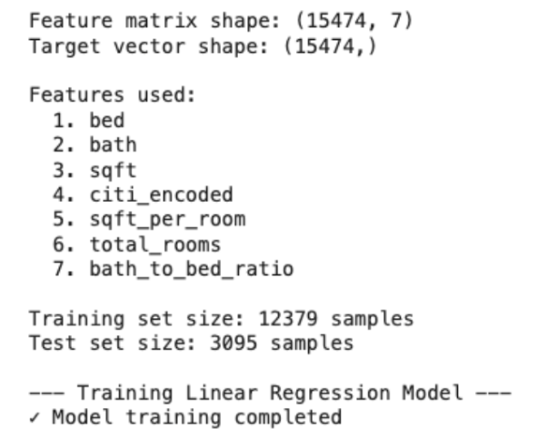

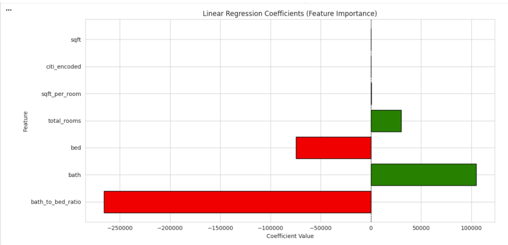

This graph presents the coefficients from our linear regression model, which starts with a baseline intercept of $244,842.70. The model places the strongest negative weight on the bath_to_bed_ratio feature, with a coefficient of -265859.88. In contrast, the bath feature provides the largest positive influence at 104797.24, which is partially offset by the bed feature's negative coefficient of -74488.77. Other features like total_rooms and sqft also contribute positively to the price, though their influence is less impactful.

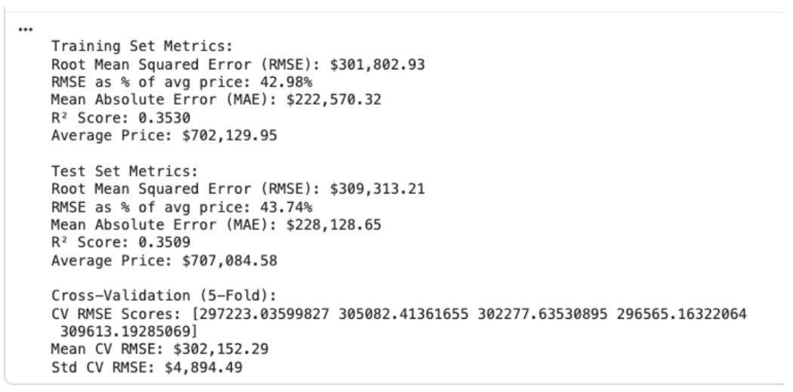

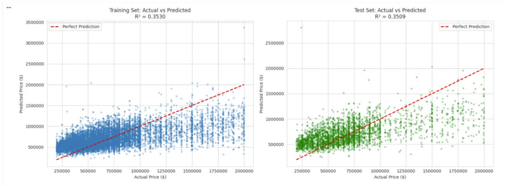

This shows our model's predictions (y-axis) against the actual prices (x-axis). The red dashed line shows where a perfect prediction would fall. We can see the blue and green dots form a very wide, scattered cloud instead of a tight line, which visually explains our moderate 0.35 R² score. This spread shows that the model understands the general trend, but its predictions have a high amount of error. The test set plot looks very similar to the training set, which again confirms that our model is consistent and not just memorizing the training data.

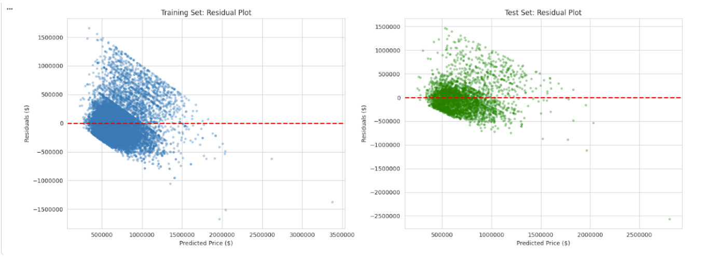

These plots show the model's prediction errors (residuals) versus the predicted prices. A clear pattern is visible in both plots: the errors are small and clustered near zero for low predicted prices, but they spread out significantly as the price increases. This pattern visually confirms that the model's accuracy gets worse when predicting more expensive properties. The test set plot shows the same trend, which confirms this is a consistent issue for the model.

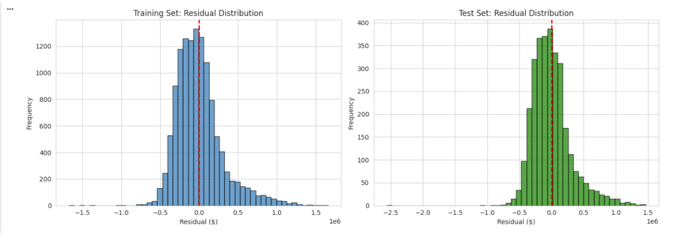

These histograms show the residual distributions for both the training and test sets. Both distributions are roughly bell-shaped and centered near zero, which is indicated by the red dashed line. This normal distribution of errors is a positive sign, suggesting that the model's errors are random and not biased in one direction. The test set's distribution closely matches the training set, which further reinforces this consistent behavior.

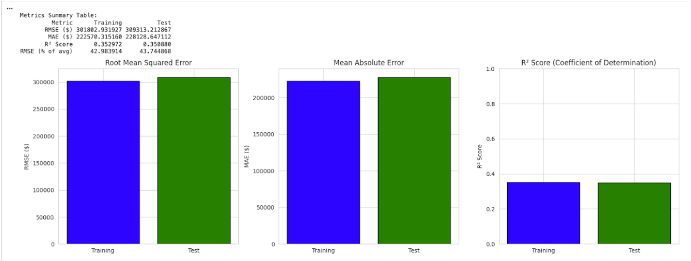

This summarizes the model's performance by comparing the training (blue) and test (green) set metrics. The charts and table show that the performance was highly consistent across both sets. For example, the R² score was 0.353 for training and 0.351 for testing, while the RMSE and MAE values were also very close. This consistency is a good sign because it indicates the model is not overfitting the training data and should perform well on unseen data.

### Quantitative Metrics

**Quantitative Metrics:**
1. **Root Mean Squared Error (RMSE)** [1]: Measures the square root of the average squared difference between predicted and actual prices. RMSE penalizes larger errors more heavily, making it useful for identifying significant mispredictions in housing prices.

2. **Mean Absolute Error (MAE):** Calculates the average absolute difference between predicted and actual prices. MAE is more interpretable and less sensitive to outliers, providing a complementary perspective to RMSE.

3. **R² Score:** Represents the proportion of variance in the target variable explained by the model. Higher values indicate better model fit and predictive power.

**Unsupervised Learning Metrics:**

1. **Silhouette Score:** Evaluates clustering quality by measuring how similar each data point is to its own cluster compared to other clusters. Higher scores indicate well-separated, distinct clusters.

2. **Explained Variance Ratio (for PCA):** Quantifies how much of the dataset’s total variance is captured by the selected principal components, helping assess dimensionality reduction effectiveness.

### Project Goals 

1. Achieve RMSE within 10–15% of the average house price in the dataset, indicating practical predictive accuracy.

2. Demonstrate that unsupervised features enhance supervised regression performance by providing additional structured information.

3. Assess model interpretability, identifying key drivers of price such as sqft, bedrooms, and neighborhood cluster segments.

4. Consider ethical implications, ensuring predictions do not reinforce biases, particularly when sensitive attributes (e.g., demographics) could influence results.

### Expected Results

1. Gradient Boosting and Random Forest models are expected to outperform linear regression due to their ability to capture nonlinear interactions and complex feature relationships.

2. Adding unsupervised features from PCA and clustering is expected to improve predictive accuracy relative to using only raw property features.

3. Outlier detection and handling will likely reduce RMSE by removing mislabeled or extreme-value records that could skew model predictions.

---

## 5. References 

- [1] Marcinrutecki, “Regression models evaluation metrics,” Kaggle, https://www.kaggle.com/code/marcinrutecki/regression-models-evaluation-metrics/notebook (accessed Oct. 2, 2025).  
- [2] A. Ihre and I. Engström, *Predicting House Prices with Machine Learning Methods*, Examensarbete inom teknik, Grundnivå, 15 HP, School of Electrical Engineering and Computer Science, KTH, Stockholm, Sweden, 2019.  
- [3] Q. Truong, M. Nguyen, H. Dang, and B. Mei, “Housing Price Prediction via Improved Machine Learning Techniques,” *Procedia Computer Science*, vol. 174, pp. 433–442, 2020, doi: 10.1016/j.procs.2020.06.111.

---

## Gantt Chart & Contributions

https://docs.google.com/spreadsheets/d/1sEn3y5obKaQtLnEJNnsmjzddWluIJcmOrhaOsC1w4q8/edit?usp=sharing

| Name      | Midterm Contributions |
|-----------|-------------------------|
| Aditya Sriram   | M1 Data Visualization, Midterm Report |
| Soham Pati      | M1 Implementation & Coding, Midterm Report |
| Blake Alford    | M1 Feature Reduction, Midterm Report |
| Erik Larson     | M1 Data Cleaning, Midterm Report |
| Eric Joseph     | M1 Results Evaluation, Midterm Report |

