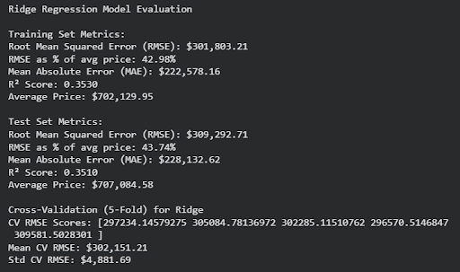
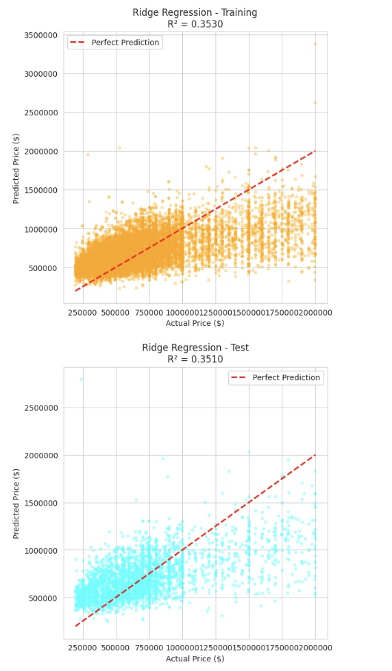
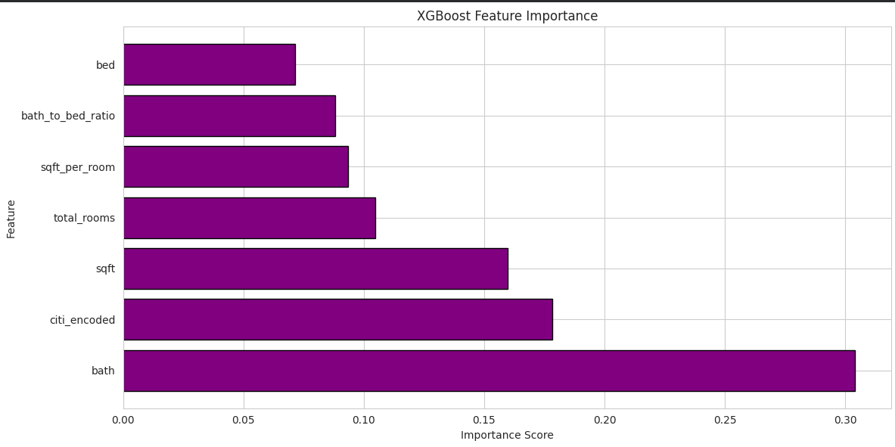
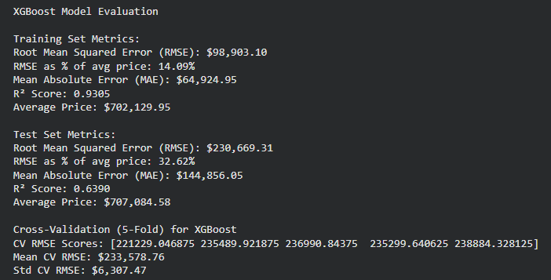
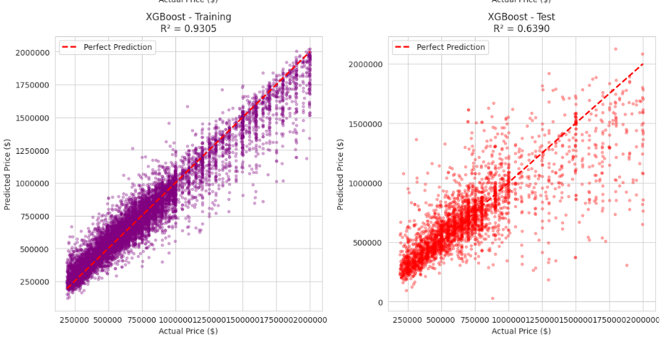
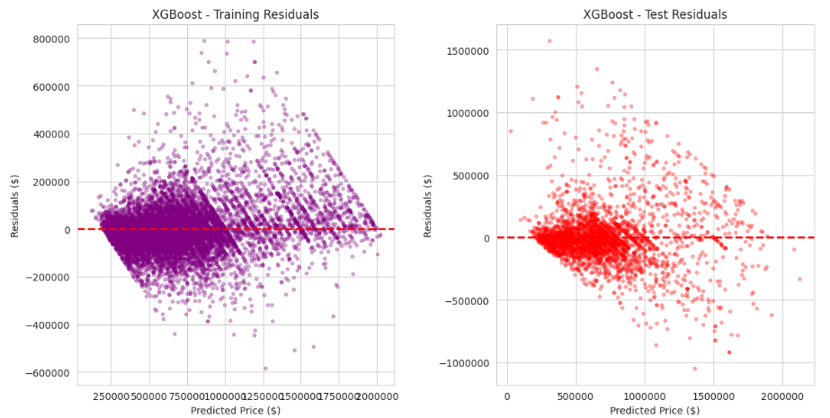
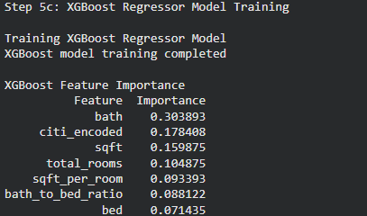
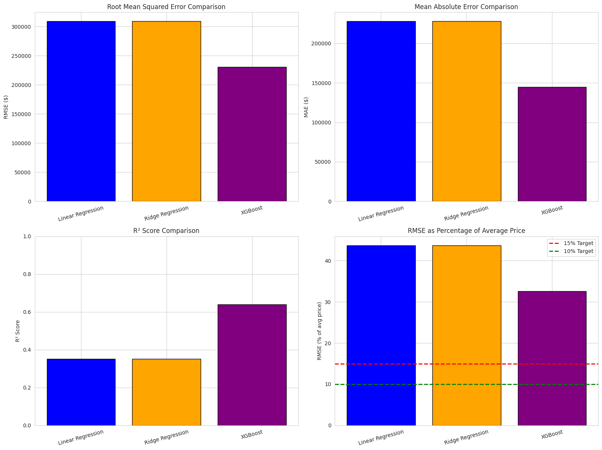

# ML Project Final: House Price Prediction in Southern California 

### Group 118  
**Aditya Sriram, Soham Pati, Blake Alford, Erik Larson, Eric Joseph**

---

## 1. Introduction / Background 

The real estate market in Southern California is always changing and one of the most expensive markets in the country. Home prices vary because of high demand and low supply. Predicting those prices becomes difficult, as there are so many factors influencing these values such as location, number of bedrooms and bathrooms, lot size, square footage, and proximity to amenities and major employment centers. 

### Dataset Description 

Our dataset contains over 15000 house prices and data. For each house we keep track of the address and city. As well as the number of rooms, bathrooms and square feet.

LINK: https://www.kaggle.com/datasets/ted8080/house-prices-and-images-socal/code

### Literature Review
Prior research has explored ML approaches for predicting housing prices. Ihre and Engström [2] found Random Forest outperformed k-Nearest Neighbors on the Ames dataset, while Truong et al. [3] showed combining traditional and ensemble methods improves accuracy when features are carefully selected.
These studies focus on numeric and structural features and rarely use unsupervised techniques. Clustering and PCA can reveal latent structures, like neighborhood clusters or price bands, enhancing predictions [2], [3]. Outlier detection can further improve accuracy. Our project integrates these insights into a supervised pipeline to predict Southern California housing prices using the 2021 Kaggle dataset [1], aiming for higher accuracy and interpretable key price drivers.

---

## 2. Problem Definition 

**Problem:** Are we able to utilize historical property data from 2021 to then create machine learning models to predict the price of a home based on property features?

**Motivation:**  Housing affordability is one of the biggest issues in all of Southern California. Creating accurate price prediction models could help buyers figure out fair market values, help realtors with price strategies and also support lawmakers in creating proper legislation using market trends.

---

## 3. Methods  

### Data Preprocessing 

1. **Missing value imputation:** sklearn.impute.SimpleImputer(strategy="median") for numeric, SimpleImputer(strategy="most_frequent") for categorical. This will ensure that data that is missing values or data that is skewed is not lost.
2. **Feature Engineering:** We can add features for half baths, and also for other important metrics like price per square foot, sqaure foot per room, etc. This will also allow us to convert our data so it more sense and can be understood better.
3. **Categorical encoding:** sklearn.preprocessing.OneHotEncoder(handle_unknown='ignore'). For features which are categorical(city, etc.) we will transform it into a numerical representation. This will alow for models like linear regression to treat cities like different entities without a ranking or order.
4. **Pipelining:** sklearn.pipeline.Pipeline to combine transforms + models for reproducibility and grid search. We can chain together the above preprocessing steps into one pipeline for easy accessibility and convenient runs.

### Machine Learning Models 

**Regression (Supervised)**

**Model/Algorithm:** Linear Regression (`sklearn.linear_model.LinearRegression`)  
A simple model that predicts housing prices as a weighted combination of input features, assuming a linear relationship.

**Ridge Regression (Supervised) Model/Algorithm**: sklearn.linear_model.Ridge
A linear model that predicts housing prices using a weighted combination of input features while applying L2 regularization. The regularization term shrinks coefficients to reduce overfitting and stabilize the model when features are correlated, but it still assumes a fundamentally linear relationship between predictors and price.

**Gradient Boosting (Supervised) Model/Algorithm** : XGBoost Regressor (xgboost.XGBRegressor)
A gradient boosting model that builds trees sequentially to correct previous errors, often achieving high accuracy on structured data.

---

## 4. Results and Discussion 
### Preprocessing Results

We used **imputation** as our first preprocessing method. Essentially what we did was, for features that were missing for entries, we took the median of the values for that feature and imputed. In the case above as you can see, our dataset was great, and had no missing values.

The screenshot above shows what we did for feature engineering. We created four features: price per square foot, square foot per room, total rooms, and bath to bed ratio. To derive price_per_sqft, we took the existing price feature and divided the sqft feature for each entry. For sqft_per_room, we took square foot of each property, divided by each bedroom. One notable thing we did: if a property had 0 bedrooms, we replaced the denominator with 1, avoiding DivideByZero error. Total rooms feature is just the summation of rooms and bathrooms.Bath to bed ratio is self explanatory.

One solution deployed in practice included the preparation of a dataset through  statistical analysis. The IQR method was used to find probable outliers in housing prices, but these were not removed because keeping them maintains full market variability and doesn't bias the data toward normal price ranges. In this case, some calculations of the lower bound for outliers were negative, which is purely a mathematical effect of the IQR formula and not a meaningful real-world value: the price of housing cannot be negative, so it simply means there are no low-value outliers.

We used encoding to turn the qualitative city name category into numerical values. This is because ML models cannot handle categorical data like city names. Each unique city string got mapped to a unique integer ID. We applied categorical encoding to convert city names into numeric representations, since linear regression models require numerical input features and cannot process categorical text directly.

### Linear Regression Model and Evaluation

This shows the last step before evaluation. First, we set up our 7 features (bed, bath, sqft, and our new engineered features) as 'X' and our price column as the 'y' target. The output lists our 7 features: bed, bath, sqft, citi_encoded, sqft_per_room, total_rooms, and bath_to_bed_ratio. We split our 15,474 samples using an 80-20 ratio, which left us with 12,379 samples for training and 3,095 for testing. The last line shows that we successfully trained our Linear Regression model on the training data and we are now ready to evaluate.

This graph presents the coefficients from our linear regression model, which starts with a baseline intercept of $244,842.70. The model places the strongest negative weight on the bath_to_bed_ratio feature, with a coefficient of -265859.88. In contrast, the bath feature provides the largest positive influence at 104797.24, which is partially offset by the bed feature's negative coefficient of -74488.77. Other features like total_rooms and sqft also contribute positively to the price, though their influence is less impactful.

This shows our model's predictions (y-axis) against the actual prices (x-axis). The red dashed line shows where a perfect prediction would fall. We can see the blue and green dots form a very wide, scattered cloud instead of a tight line, which visually explains our moderate 0.35 R² score. This spread shows that the model understands the general trend, but its predictions have a high amount of error. The test set plot looks very similar to the training set, which again confirms that our model is consistent and not just memorizing the training data.

These plots show the model's prediction errors (residuals) versus the predicted prices. A clear pattern is visible in both plots: the errors are small and clustered near zero for low predicted prices, but they spread out significantly as the price increases. This pattern visually confirms that the model's accuracy gets worse when predicting more expensive properties. The test set plot shows the same trend, which confirms this is a consistent issue for the model.

These histograms show the residual distributions for both the training and test sets. Both distributions are roughly bell-shaped and centered near zero, which is indicated by the red dashed line. This normal distribution of errors is a positive sign, suggesting that the model's errors are random and not biased in one direction. The test set's distribution closely matches the training set, which further reinforces this consistent behavior.

This summarizes the model's performance by comparing the training (blue) and test (green) set metrics. The charts and table show that the performance was highly consistent across both sets. For example, the R² score was 0.353 for training and 0.351 for testing, while the RMSE and MAE values were also very close. This consistency is a good sign because it indicates the model is not overfitting the training data and should perform well on unseen data.

### Ridge Regression Model and Evaluation

This summarizes the model's performance by providing training and test set metrics. The metrics point to a model that consistently underfits the structure of Southern California housing prices. Errors remain extremely high—RMSE above $300k, over 40% of the typical home price—and the near-identical train and test performance shows that the model isn’t struggling with variance but with limited capacity to capture meaningful relationships. Cross-validation reinforces this, with low spread across folds but equally weak results, indicating stable yet shallow learning. Regularization from Ridge smooths out patterns that, in housing markets, tend to be nonlinear and heavily driven by location-specific factors, so important signals end up muted. Overall, the output reflects a model that captures broad averages but misses the finer-grained dynamics required for practical price prediction in this domain.

The scatter plots make the model’s limitations even harder to ignore. Predictions cluster tightly in a narrow band, especially for higher-priced homes, which shows that the model collapses a wide range of actual values into similar predicted outputs. Instead of tracking the upward trajectory of real prices, the estimates flatten out and drift toward the mean, a classic sign of heavy regularization suppressing meaningful variation. The wide vertical spread at almost every actual price point reflects substantial error, and the consistent gap between the cloud of points and the perfect-prediction line shows that the model systematically understates expensive homes while overstating cheaper ones. The nearly identical R² values for training and test data, combined with the similar scatter patterns, confirm that this isn’t an overfitting issue; the model simply doesn’t capture enough of the underlying structure to produce accurate or nuanced predictions.

### XGBoost Model and Evaluation 

This graph displays the feature importance scores from our XGBoost model, showing which features have the most influence on predicting house prices. The bath feature dominates with an importance score of approximately 0.30, making it by far the most influential predictor. The citi_encoded feature comes in second at around 0.18, followed by sqft at approximately 0.16. The remaining features (total_rooms, sqft_per_room, bath_to_bed_ratio, and bed) have progressively smaller importance scores, all below 0.11. This ranking reveals that the number of bathrooms, location (city), and square footage are the key drivers of price predictions in this model.

This evaluation summary shows the XGBoost model's performance metrics across training, test, and cross-validation. On the training set, the model achieved an impressive R² score of 0.9305 with an RMSE of $98,903.10 (14.09% of average price). However, the test set shows more realistic performance with an R² of 0.6390 and RMSE of $230,669.31 (32.62% of average price). The 5-fold cross-validation results show a mean CV RMSE of $233,578.76 with a standard deviation of $6,307.47, indicating consistent but moderate performance. The significant gap between training (93% variance explained) and test (64% variance explained) performance suggests some overfitting, though the model still outperforms the linear regression baseline substantially.

These scatter plots compare predicted prices (y-axis) against actual prices (x-axis) for both training and test sets. The training set (left, purple) shows points tightly clustered along the red dashed "perfect prediction" line, confirming the high R² of 0.9305. In contrast, the test set (right, red) shows considerably more scatter around the perfect prediction line, though still maintaining a clear positive correlation. This visual confirms the R² of 0.6390 and reveals that while the model has learned the training data very well, it has moderate generalization to unseen data. The spread increases at higher price points, indicating the model struggles more with expensive properties.

These residual plots show the prediction errors versus predicted prices for both datasets. The training set (left, purple) displays remarkably small and evenly distributed residuals across all price ranges, with most errors clustered very close to the zero line. This tight pattern reflects the model's excellent fit to training data. The test set (right, red) shows a much wider spread of residuals, particularly at higher predicted prices, forming a funnel shape. This heteroscedasticity (increasing variance with price) indicates that prediction accuracy decreases for more expensive properties, which is a common challenge when predicting real estate prices across a wide range.

This text output confirms the feature importance rankings from the XGBoost model training. Bath leads with an importance of 0.303893, followed by citi_encoded at 0.178408, and sqft at 0.159875. The engineered features total_rooms (0.104875), sqft_per_room (0.093393), and bath_to_bed_ratio (0.088122) provide moderate contributions, while bed (0.071435) has the lowest importance. These values quantify each feature's contribution to the model's decision-making process and help explain why certain features drive price predictions more than others.

### Quantitative Metrics for Linear Regression

**Root Mean Squared Error (RMSE)**: The RMSE measures the average magnitude of prediction errors in the same units as the target variable (price). Our model produced an RMSE of $309,313.21. This metric is measured in the same units as the target (price), so this gives an average prediction deviation of $309K. This figure represents approximately 43.7% of the average home price in the dataset.

**Mean Absolute Error (MAE)**: The model's MAE was $228,128.65, meaning the typical absolute error between a prediction and the actual sale price is $228K. While this figure is high, it was anticipated given the dataset's wide range of prices and significant market variability.

**R² Score**: The model achieved an R² value of 0.3509, meaning it explains about 35% of the variance in home prices. This is a moderate score because it indicates the model has captured some core linear relationships, but it is not yet accounting for other complex factors, such as nonlinear trends or location-based data, which are missing from the current feature set.

### Quantitative Metrics for XGBoost

**Root Mean Squared Error (RMSE):** The XGBoost model achieved an RMSE of $230,669.31 on the test set, which represents approximately 32.62% of the average home price in the dataset ($707,084.58). This is a substantial improvement over the Linear Regression model's RMSE of $309,313.21 (43.7% of average price), representing a 25% reduction in prediction error. The training RMSE was notably lower at $98,903.10 (14.09% of average price), indicating the model learned the training patterns very effectively.

**Mean Absolute Error (MAE):** The model's test MAE was $144,856.05, meaning the typical absolute error between a prediction and the actual sale price is approximately $145K. This is a significant improvement over the Linear Regression MAE of $228,128.65, representing a 36% reduction in typical prediction errors. The training MAE of $64,924.95 further demonstrates the model's strong fit to training data.

**R² Score:** The XGBoost model achieved an R² value of 0.6390 on the test set, meaning it explains approximately 64% of the variance in home prices. This nearly doubles the explanatory power of the Linear Regression model (35% variance explained) and represents a substantial improvement in predictive capability. The training R² of 0.9305 indicates the model captured 93% of training variance, though the gap between training and test performance suggests some overfitting. The 5-fold cross-validation produced a mean RMSE of $233,578.76 with a standard deviation of $6,307.47, confirming consistent performance across different data splits.

### Deeper Analysis of Linear Regression

Our Linear Regression model was built using seven features: sqft_living, bedrooms, bathrooms, city, sqft_per_room, total_rooms, and bath_to_bed_ratio. As expected, square footage showed the strongest positive correlation with price, confirming that larger homes command higher prices. The city feature was also a significant driver, highlighting strong regional differences in value.

The bath_to_bed_ratio feature gave a large negative coefficient ($-265,859.88), which at first seems counterintuitive, as more bathrooms typically add value. This result is explained by multicollinearity between the ratio and the individual bedroom and bathroom counts. When those features are held constant, an increase in the ratio often reflects fewer bedrooms rather than more bathrooms, leading to the lower predicted price.

Overall, the model provides a clear, interpretable baseline that confirms the linear relationships between home attributes and sale prices. However, the moderate R² score and large residuals strongly suggest that the data contains nonlinear trends and feature interactions that a simple linear model cannot capture. We had hoped for a R score value of 0.7 or higher to suggest linear correlation but since the score did not show that it just means that this model is not the right fit got it.

### Deeper Analysis of Ridge Regression

Ridge Regression, implemented through sklearn.linear_model.Ridge, extends ordinary linear regression by adding an L2 penalty on the magnitude of coefficients. This regularization term penalizes large weights and is useful to stabilize the solution when the dataset contains multicollinearity, or when there are high-dimensional feature spaces. Converting the problem into one that favors smaller coefficients emphasizes more conservative relationships between predictors and the target variable. In exchange for stability and a lack of extreme swings in prediction, it reduces the capability of the model to express complex interactions or nonlinear dynamics. The result is that Ridge tends to yield smoother and more generalizable fits but at a cost in expressiveness.

Applied to the prediction of housing prices-in markets as heterogeneous as Southern California, for instance-this tradeoff becomes pronounced. Housing prices reflect sharp nonlinear effects: neighborhood desirability, school district boundaries, proximity to amenities, local zoning, and micro-geographic variation. Ridge treats all these influences as linear contributions and further dampens their impact via regularization. This leads to systematic compression of predictions: expensive homes are undervalued, cheaper homes overestimated, and the model gravitates toward the overall mean. The resulting predictions capture broad directional trends but fail to reflect the true spread and skewness of real estate markets.

Because Ridge maintains similar performance between training and test sets, its errors reflect a consistent underfitting problem rather than sensitivity to noise or variance. The model is structurally incapable of learning the deeper, intricate relationships necessary for high-fidelity price estimation. In settings where the signal is largely nonlinear and contextual, Ridge serves more as a baseline benchmark for model comparison rather than a viable predictive tool. It underlines the limits of linear regularized methods and points to the need for more flexible algorithms-such as gradient boosting or tree-based ensembles-for targets with complex, high-variance behavior like home prices.

### Deeper Analysis of XGBoost

Our XGBoost model utilized the same seven features as the Linear Regression baseline but revealed dramatically different patterns through its gradient boosting approach. The bath feature emerged as the dominant predictor with an importance score of 30%, followed by citi_encoded at 18% and sqft at 16%. This differs significantly from the linear model, where the tree-based structure allowed XGBoost to capture nonlinear relationships and complex location-specific pricing patterns. The engineered features (total_rooms, sqft_per_room, and bath_to_bed_ratio) collectively contributed about 29% to predictions, and unlike the linear model where multicollinearity caused issues, XGBoost successfully leveraged these correlated features without confusion.

The performance characteristics reveal both strengths and limitations of the model. The significant gap between training R² (0.93) and test R² (0.64) indicates overfitting, where the model learned training patterns too well and captured some noise. The residual plots show that prediction errors increase substantially for expensive properties, forming a funnel pattern that suggests the model struggles with high-end homes where unmeasured factors like luxury amenities, views, and architectural significance become more important. Despite these limitations, the test performance still substantially exceeds the Linear Regression baseline, validating the choice of a more complex model.

Overall, the XGBoost model successfully demonstrates that gradient boosting can substantially improve prediction accuracy for real estate pricing, nearly doubling the explained variance from 35% to 64%. While some overfitting occurred and approximately $234K average prediction error remains, the model represents a significant advancement over linear methods and confirms that machine learning approaches can effectively capture the complex, nonlinear relationships in real estate valuation. The feature importance analysis provides clear insights into price drivers, with bathrooms, location, and square footage emerging as the most critical factors.

### Comparison of Approaches

We saw a clear performance gap between the linear baselines and the gradient boosting model when looking at the metrics. Both Linear and Ridge Regression stalled at an R-squared of approximately 0.35 and an RMSE over 309,000 dollars. This shows that adding regularization in the Ridge model did not solve the fundamental issue, which was that linear equations simply could not capture the complexity of the housing market. In contrast, XGBoost achieved a test R-squared of 0.64 and reduced the RMSE to roughly 230,000 dollars. This represents a 25% reduction in prediction error, confirming that the ensemble method successfully minimized the residual spread where the linear equations failed.

The main reason for this disparity was how the models handled categorical data and non-linear interactions. Our dataset used label encoding for cities, which the linear models interpreted mathematically, erroneously assuming a ranked relationship between arbitrary City IDs. XGBoost utilized decision trees and avoided this by creating binary splits to isolate specific high-value locations without assuming a mathematical progression. Additionally, the housing market contains complex curves, such as diminishing returns on square footage, that linear models flattened out, whereas XGBoost successfully mapped these interactions.

Despite its superior accuracy, XGBoost introduced tradeoffs regarding interpretability and variance. The linear models offered high transparency, allowing us to explicitly state the dollar value of a feature like a bathroom via coefficients, while XGBoost acts as a black box where we can only rank relative feature importance. Furthermore, the comparison reveals a shift from high bias to high variance. The linear models consistently underfit the data, while XGBoost showed clear signs of overfitting as indicated by the large gap between its 93% training score and 64% test score. Ultimately, however, the drastic reduction in error makes XGBoost the preferred model for this specific problem.

**Next Steps**

Moving forward, we plan to continue improving our models in several ways. We will explore Ridge and Lasso Regression to reduce multicollinearity, and test tree-based methods such as Random Forests, Gradient Boosted Trees, and CatBoost to try and capture the complex relationships better and improve our prediction accuracy. We also want to try a log transform of home prices in our preprocessing, which would reduce the impact of high-end outliers and hopefully make the distribution more symmetric. This would help our models fit cleaner patterns and improve our metrics. We could also try KNN regression as a diagnostic to see if there’s meaningful local structure in the feature space that our current models aren’t currently capturing.

Overall, these steps aim to refine feature handling, enhance model stability, and improve generalization for more accurate predictions.

## 5. References 

- [1] Marcinrutecki, “Regression models evaluation metrics,” Kaggle, https://www.kaggle.com/code/marcinrutecki/regression-models-evaluation-metrics/notebook (accessed Oct. 2, 2025).  
- [2] A. Ihre and I. Engström, *Predicting House Prices with Machine Learning Methods*, Examensarbete inom teknik, Grundnivå, 15 HP, School of Electrical Engineering and Computer Science, KTH, Stockholm, Sweden, 2019.  
- [3] Q. Truong, M. Nguyen, H. Dang, and B. Mei, “Housing Price Prediction via Improved Machine Learning Techniques,” *Procedia Computer Science*, vol. 174, pp. 433–442, 2020, doi: 10.1016/j.procs.2020.06.111.

---

## Gantt Chart & Contributions

https://docs.google.com/spreadsheets/d/1sEn3y5obKaQtLnEJNnsmjzddWluIJcmOrhaOsC1w4q8/edit?usp=sharing

| Name      | Final Contributions |
|-----------|-------------------------|
| Aditya Sriram   | M2/3 Data Visualization, Final Report, Github Formatting, Feature Processing, XGBoost analysis |
| Soham Pati      | M2/3 Implementation & Coding, Final Report, Analysis and Writeup, Ridge Reg Analysis |
| Blake Alford    | M2/3 Feature Reduction, Final Report, Feature Processing and Analysis, Gantt Chart |
| Erik Larson     | M2/3 Data Cleaning, Final Report, XGBoost Model Improvement, Graph Creation, Quanitative Analysis |
| Eric Joseph     | M2/3 Results Evaluation, Final Report, Analysis and Writeup, Model Comparison |
